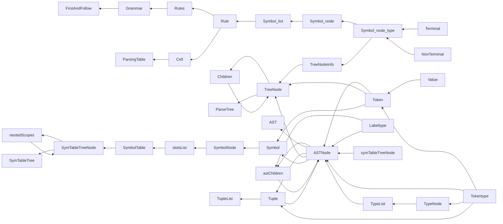

# Data Structures Used
## lexerDef.h, parserDef.h, astDef.h, intermediateCodeDef.h, NaryTreeDef.h, symbolTableDef.h

```mermaid
graph RL;
    Terminal --> Symbol_node_type
    click Terminal "http://__enum" "Enum";

    NonTerminal --> Symbol_node_type;
    click NonTerminal "http://__enum" "Enum";
    
    click Symbol_node_type "http://__Union_of__Terminal_And_NonTerminal"
    Symbol_node_type --> Symbol_node

    click Symbol_node "http://__Struct_of_Symbol_node_type__int_term_or_nonterm__ptr_to_next_Symbol_node"
    Symbol_node --> Symbol_list

    click Symbol_list "http://__Struct_of_ptr_to_Symbol_node__int_length"
    Symbol_list --> Rule
    
    click Rule "http://__Struct_of__ptr_to_symbol_list__ptr_to_next_rule__int_rule_no"
    Rule --> Rules

    click Rules "http://__struct_of__ptr_to_rule__int_length"
    Rules --> Grammar

    click Grammar "http://__struct_of__ptr_to_ptr_to_rules__int_no_of_rules"
    Grammar --> FirstAndFollow

    click FirstAndFollow "http://__struct_of__ptr2ptr2int_first__ptr2ptr2int_follow"

    Rule --> Cell
    click Cell "http://__struct_of__ptr2rule__int_non_term_index"

    Cell --> ParsingTable
    click ParsingTable "http://__struct_of__ptr2_2dim_array_of_cell_size_TOTAL_NON_TERMINALS_by_TOTAL_TERMINALS_"


    Value --> Token;
    Tokentype --> Token;

    click Value "http://__union_of_int_num_and_float_r_num";    
    click Tokentype "http://__enum";
    click Token "http://__struct_of__tokentype_type__int_valuetype__int_lineno__string_lexeme__value_value";


    Labeltype --> astChildren;
    ASTNode --> astChildren;
    
    Labeltype --> ASTNode;
    astChildren --> ASTNode;
    Token --> ASTNode;
    symTableTreeNode --> ASTNode;
    Tokentype --> ASTNode;
    TypeList --> ASTNode;
    Tuple --> ASTNode;
    ASTNode --> AST;

    TypeNode --> TypeList;
    Tokentype --> TypeNode;
    
click Labeltype "http://__enum";
click astChildren "http://__struct_of__ptr2ASTNode_head__ptr2ASTNode_last__int_no_siblings";
click TypeNode "http://__struct_of__tokentype_type__ptr2typenode_next";
click TypeList "http://__struct_of__ptr2typeListNode_head__ptr2typeListNode_last__int_no_of_siblings";
click ASTNode "http://__khud_dekh_lo_astdef.h_me";
click AST "http://__ptr2astnode";


Tokentype --> Tuple;
ASTNode --> Tuple;
Tuple --> TupleList;
click Tuple "http://__struct_of__tokentype_op__strs_arg1_arg2_result__ptr2tuple_next__ptr2astnode_node1_node2_node3"
click TupleList "http://__struct_of__ptr2tuple_head_last__int_total_tuples"


Symbol_node_type --> TreeNodeInfo;
TreeNode --> Children;
TreeNodeInfo --> TreeNode;
Token --> TreeNode;
Children --> TreeNode;
ASTNode --> TreeNode;
TreeNode --> ParseTree;

click TreeNode "http://__struct_of__ptr2treenode_next__ptr2treenode_parent__ptr2treeinfonode_info__ptr2token_lexicaltoken__ptr2children__astnode_addr__ptr2children_inh_addr";
click ParseTree "http://__ptr2treenode_root";
click TreeNodeInfo "http://__int_term_or_nonterm__Symbol_node_type_type";
click TreeNodeInfo "http://__int_term_or_nonterm__Symbol_node_type_type";
click Children "http://__ptr2treenode_head__no_siblings";


SymbolTable --> SymTableTreeNode;
nestedScopes --> SymTableTreeNode;

SymTableTreeNode --> nestedScopes;
SymTableTreeNode --> SymTableTree;

Token --> Symbol;
ASTNode --> Symbol;

Symbol --> SymbolNode;
SymbolNode --> slotsList
slotsList --> SymbolTable

click SymTableTreeNode "http://__symboltable_table__nestedScopes_children__symTableTreeNode_next__symTableTreeNode_parent__str_scope"
click nestedScopes "http://__symTableTreeNode_head__int_no_siblings"
click SymTableTree "http://__ptr2SymTableTreeNode_root"
click Symbol "http://__see_at_symbolTabledef.h"
click SymbolNode "http://__Symbol_symbol__ptr2symbolNode_next"
click SymbolTable "http://__int_no_slots__ptr2ptr2slotslist_slots"
click slotsList "http://__SymbolNode_head__int_total_symbols"
```