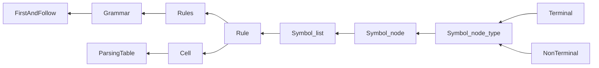

# Data Structures Used

```mermaid
graph RL;
    Terminal --> Symbol_node_type
    click Terminal "http://__enum" "Enum";

    NonTerminal --> Symbol_node_type;
    click NonTerminal "http://__enum" "Enum";
    
    click Symbol_node_type "http://__Union_of__Terminal_And_NonTerminal"
    Symbol_node_type --> Symbol_node

    click Symbol_node "http://__Struct_of_Symbol_node_type__int_term_or_nonterm__ptr_to_next_Symbol_node"
    Symbol_node --> Symbol_list

    click Symbol_list "http://__Struct_of_ptr_to_Symbol_node__int_length"
    Symbol_list --> Rule
    
    click Rule "http://__Struct_of__ptr_to_symbol_list__ptr_to_next_rule__int_rule_no"
    Rule --> Rules

    click Rules "http://__struct_of__ptr_to_rule__int_length"
    Rules --> Grammar

    click Grammar "http://__struct_of__ptr_to_ptr_to_rules__int_no_of_rules"
    Grammar --> FirstAndFollow

    click FirstAndFollow "http://__struct_of__ptr2ptr2int_first__ptr2ptr2int_follow"

    Rule --> Cell
    click Cell "http://__struct_of__ptr2rule__int_non_term_index"

    Cell --> ParsingTable
    click ParsingTable "http://__struct_of__ptr2_2dim_array_of_cell_size_TOTAL_NON_TERMINALS_by_TOTAL_TERMINALS_"
```

